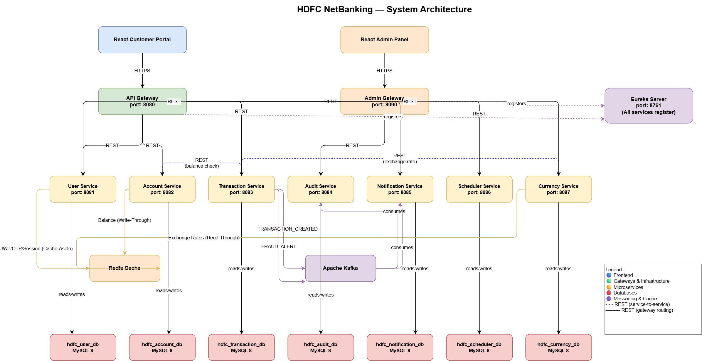
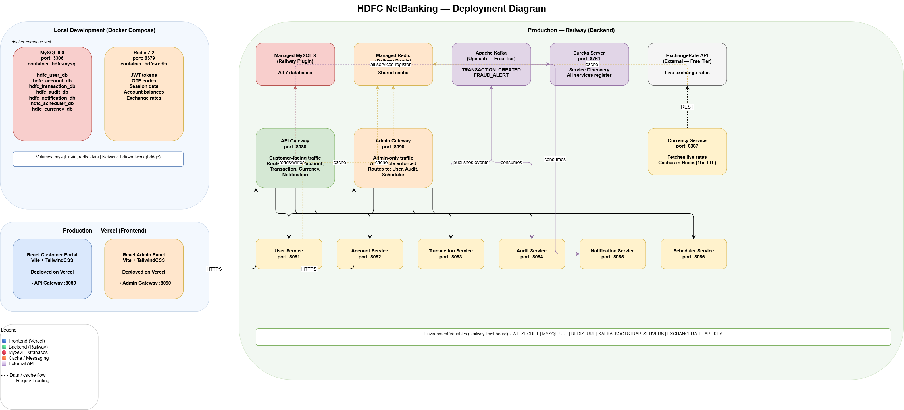
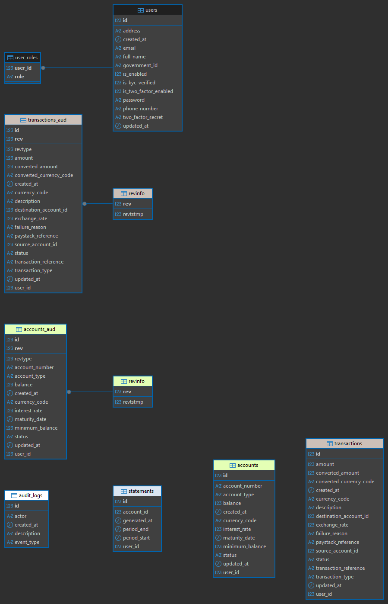
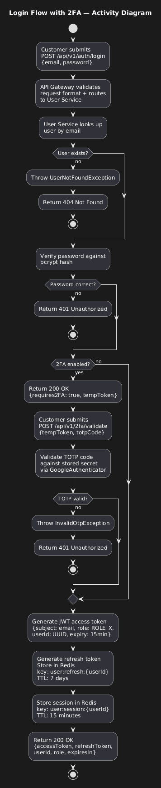
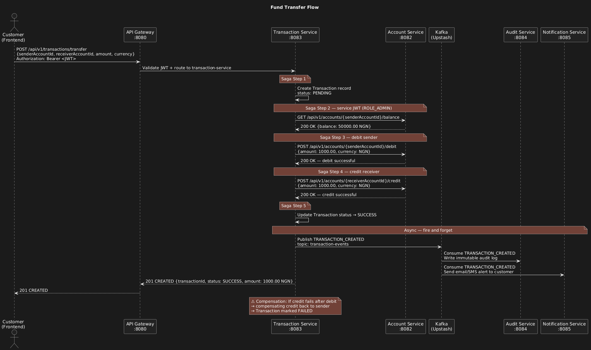

# HDFC NetBanking

A production-grade microservices banking platform built with Java 21, Spring Boot 3, and React 18. Implements core retail banking operations — account management, fund transfers, real-time notifications, audit logging, and live currency conversion — across 10 independently deployable services orchestrated via Eureka Service Discovery.

**Live Frontend → [hdfc-netbanking.vercel.app](https://hdfc-netbanking.vercel.app)**

> The frontend is deployed on Vercel. The backend runs locally via a single `docker compose up` command. See [Running Locally](#running-locally) for setup instructions.

---

## Table of Contents

- [Architecture Overview](#architecture-overview)
- [Tech Stack](#tech-stack)
- [Services](#services)
- [Key Engineering Decisions](#key-engineering-decisions)
- [Running Locally](#running-locally)
- [Architecture Diagrams](#architecture-diagrams)
- [Test Summary](#test-summary)
- [Open GitHub Issues](#open-github-issues)
- [Demo](#demo)
- [Author](#author)

---

## Architecture Overview



HDFC NetBanking follows a **microservices architecture** with two API gateways — one for customer-facing traffic and one for admin-only traffic. All services register with a central Eureka Server and communicate via load-balanced service discovery (`lb://service-name`). Asynchronous event-driven communication is handled through Kafka, with the Transaction Service as the primary producer and Audit and Notification Services as consumers.

```
Frontend (Vercel)
      │
      ├──► API Gateway (port 8080)        ← customer traffic
      │         │
      │         └── lb:// routing via Eureka ──► User, Account, Transaction, Currency Services
      │
      └──► Admin Gateway (port 8090)      ← admin-only traffic
                │
                └── lb:// routing via Eureka ──► Audit, Scheduler Services

Transaction Service ──► Kafka (transaction-events) ──► Audit Service
                                                   └──► Notification Service

Scheduler Service ──► Kafka (statement-events) ──► Notification Service
```

---

## Tech Stack

| Layer | Technology |
|---|---|
| Backend Language | Java 21 |
| Backend Framework | Spring Boot 3.2.3 |
| Service Discovery | Spring Cloud Netflix Eureka |
| API Gateway | Spring Cloud Gateway |
| Build Tool | Maven (multi-module) |
| Database | MySQL 8.0 — database-per-service |
| Cache | Redis 7.2 |
| Message Broker | Apache Kafka (Confluent 7.5) |
| ORM | Spring Data JPA / Hibernate |
| Audit Trail | Hibernate Envers |
| Security | Spring Security, JWT (HS256), TOTP 2FA |
| HTTP Client | WebClient (reactive) |
| Payments | Paystack |
| Currency API | ExchangeRate-API v6 |
| Containerisation | Docker, Docker Compose |
| Frontend Language | TypeScript |
| Frontend Framework | React 18 + Vite |
| Styling | TailwindCSS v3 |
| State Management | Zustand (client), TanStack Query (server) |
| HTTP | Axios |
| Routing | React Router v6 |
| Frontend Testing | Vitest + React Testing Library |
| Backend Testing | JUnit 5 + Mockito |
| Frontend Deployment | Vercel |

---

## Services

| Service | Port | Responsibility |
|---|---|---|
| **Eureka Server** | 8761 | Service registry — all services register and discover each other here |
| **API Gateway** | 8080 | Customer-facing reverse proxy — routes `/api/v1/**` to downstream services, enforces CORS |
| **Admin Gateway** | 8090 | Admin-only reverse proxy — routes `/api/admin/**`, enforces JWT authentication |
| **User Service** | 8081 | Registration, JWT auth with refresh token rotation, TOTP-based 2FA, RBAC (CUSTOMER / TELLER / ADMIN), KYC |
| **Account Service** | 8082 | Bank account creation, balance management, Redis Write-Through caching, PESSIMISTIC_WRITE locking, Hibernate Envers audit trail |
| **Transaction Service** | 8083 | Fund transfers via Saga orchestration, Paystack webhook handling, Kafka event publishing, service-to-service JWT auth |
| **Audit Service** | 8084 | Immutable audit log — consumes `transaction-events` from Kafka, append-only persistence |
| **Notification Service** | 8085 | Email and SMS notifications — consumes `transaction-events` from Kafka, Strategy pattern for extensible channels |
| **Scheduler Service** | 8086 | Cron jobs — monthly statement generation, interest accrual, OTP cleanup; publishes `statement-events` to Kafka |
| **Currency Service** | 8087 | Live exchange rates via ExchangeRate-API v6, Redis Read-Through caching with 1-hour TTL |

---

## Key Engineering Decisions

### Saga Orchestration for Fund Transfers
The Transaction Service acts as a Saga orchestrator for fund transfers, coordinating debit and credit operations across Account Service via REST/WebClient. If any step fails, compensating transactions are triggered to maintain consistency — avoiding distributed transactions while preserving data integrity across service boundaries.

### Defence-in-Depth Security
Security is enforced at multiple layers: the API Gateway validates JWT tokens on all inbound requests, individual services perform their own token validation, and RBAC (Role-Based Access Control) with three roles — CUSTOMER, TELLER, ADMIN — restricts endpoint access at the method level. The Admin Gateway adds a third enforcement layer for admin-only operations.

### Service-to-Service JWT Authentication
Rather than using a service mesh or mutual TLS, inter-service calls are authenticated using a dedicated service JWT. The Transaction Service mints a short-lived JWT (subject: `transaction-service`, `userId: 0` sentinel, 24-hour expiry, `ROLE_ADMIN`) for calls to Account Service. This keeps the auth model consistent and avoids introducing a separate identity system for internal traffic.

### Redis Caching Strategy — Three Patterns
Three different caching strategies are used across the platform, each chosen for its access pattern. Account Service uses **Write-Through** (every balance update writes to Redis and MySQL simultaneously — 30-second TTL as a safety net). Currency Service uses **Read-Through** (exchange rates fetched from ExchangeRate-API on cache miss, cached for 1 hour — rates change slowly). User Service uses **Cache-Aside** (application code manages cache population explicitly).

### Database-Per-Service
Each service owns its own MySQL database exclusively. No service ever queries another service's database directly. Cross-service data access is always through REST calls. This enforces bounded contexts and allows each service to evolve its schema independently.

### TDD Discipline — RED-GREEN-REFACTOR
All services were built following strict Test-Driven Development. Tests were written before implementation code throughout the project. 176 unit tests across all services — all passing.

### JSR-354 Moneta for Monetary Arithmetic
The Transaction Service uses the JSR-354 Moneta library for all monetary calculations, preventing floating-point precision errors on financial amounts. The frontend treats all monetary values as strings and never performs arithmetic in JavaScript.

---

## Running Locally

### Prerequisites

- [Docker Desktop](https://www.docker.com/products/docker-desktop/) — must be running
- Git
- 8 GB RAM minimum allocated to Docker (see WSL 2 note below)

> **Windows users (WSL 2):** Create or update `C:\Users\{username}\.wslconfig` with the following to give Docker sufficient resources:
> ```ini
> [wsl2]
> memory=8GB
> processors=4
> swap=2GB
> ```
> Then run `wsl --shutdown` and restart Docker Desktop.

### Setup

**1. Clone the repository**
```bash
git clone https://github.com/adebola-folorunsho/hdfc-netbanking-backend.git
cd hdfc-netbanking-backend
```

**2. Configure environment variables**
```bash
cp .env.example .env
```

Open `.env` and fill in the required values:

| Variable | Description |
|---|---|
| `MYSQL_ROOT_PASSWORD` | Any password for the local MySQL root user |
| `MYSQL_USERNAME` | MySQL application user (e.g. `hdfc_user`) |
| `MYSQL_PASSWORD` | MySQL application password |
| `REDIS_PASSWORD` | Any password for the local Redis instance |
| `JWT_SECRET` | At least 32 characters — must be identical across all services |
| `PAYSTACK_SECRET_KEY` | From [Paystack dashboard](https://dashboard.paystack.com/#/settings/developers) — use `sk_test_` sandbox key |
| `PAYSTACK_WEBHOOK_SECRET` | From Paystack dashboard under API Keys & Webhooks |
| `GMAIL_USERNAME` | Gmail address for sending notification emails |
| `GMAIL_APP_PASSWORD` | Gmail App Password — generate at Google Account → Security → App Passwords |
| `EXCHANGERATE_API_KEY` | Free API key from [exchangerate-api.com](https://www.exchangerate-api.com) |

**3. Start the full stack**
```bash
docker compose up --build
```

This builds all 10 service images and starts the complete stack — MySQL, Redis, Zookeeper, Kafka, Eureka Server, both gateways, and all 7 domain services. First run takes approximately 10-15 minutes to build all images.

**4. Verify everything is running**

Open [http://localhost:8761](http://localhost:8761) — the Eureka dashboard should show all 9 services registered and UP:

```
ACCOUNT-SERVICE       UP
ADMIN-GATEWAY         UP
API-GATEWAY           UP
AUDIT-SERVICE         UP
CURRENCY-SERVICE      UP
NOTIFICATION-SERVICE  UP
SCHEDULER-SERVICE     UP
TRANSACTION-SERVICE   UP
USER-SERVICE          UP
```

**5. Connect the frontend**

Clone and run the frontend:
```bash
git clone https://github.com/adebola-folorunsho/hdfc-netbanking-frontend.git
cd hdfc-netbanking-frontend
cp .env.example .env
npm install
npm run dev
```

The frontend runs at [http://localhost:5173](http://localhost:5173) and connects to the local backend automatically.

### Stopping the stack
```bash
docker compose down          # stop containers, preserve data volumes
docker compose down -v       # stop containers and delete all data
```

---


## Architecture Diagrams

### System Architecture


### Deployment Diagram


### Entity Relationship Diagram


### API Flow Diagram


### Sequence Diagram


---

## Test Summary

| Service | Tests | Status |
|---|---|---|
| Eureka Server | 1 | ✅ Passing |
| Admin Gateway | 7 | ✅ Passing |
| User Service | 48 | ✅ Passing |
| Account Service | 29 | ✅ Passing |
| Transaction Service | 30 | ✅ Passing |
| Audit Service | 13 | ✅ Passing |
| Notification Service | 11 | ✅ Passing |
| Scheduler Service | 11 | ✅ Passing |
| Currency Service | 8 | ✅ Passing |
| **Backend Total** | **158** | **✅ All passing** |
| Frontend | 253 | ✅ Passing |
| **Combined Total** | **411** | **✅ All passing** |

All backend services were built following strict **RED-GREEN-REFACTOR** TDD discipline. Tests were written before implementation code throughout the project.

---

## Open GitHub Issues

The following items are deferred by design — architectural decisions were made to ship a complete, working system first and address these in subsequent iterations:

| # | Service | Issue |
|---|---|---|
| 1 | Transaction Service | Paystack webhook HMAC-SHA512 signature verification hardening |
| 2 | Transaction Service | CUSTOMER ownership check for accounts with zero transactions |
| 3 | Audit Service | Dead-letter topic for malformed Kafka messages |
| 4 | Notification Service | Dead-letter topic for malformed Kafka messages |
| 5 | Notification Service | Real SMS provider integration (Twilio / Termii) |
| 6 | Scheduler Service | Daily interest accrual implementation (Account Service integration) |
| 7 | Scheduler Service | OTP cleanup implementation (User Service integration) |
| 8 | Scheduler Service | Replace hardcoded seed accounts with Account Service API call |
| 9 | Notification Service | `statement-events` Kafka consumer for monthly statement emails |

---

## Demo

> 🎬 **Demo video coming soon** — will show full end-to-end flow: registration, 2FA setup, account creation, fund transfer, audit log, and real-time email notification.

---

## Author

**Adebola Folorunsho**
Backend Software Engineer — Java, Spring Boot, TypeScript, NestJS

[](https://www.linkedin.com/in/adebola-f-40b572208/)
[](https://my-portfolio-alpha-swart-39.vercel.app/)
[](https://github.com/adebola-folorunsho/hdfc-netbanking-frontend)

---

*Built as a portfolio capstone project at Semicolon Africa.*